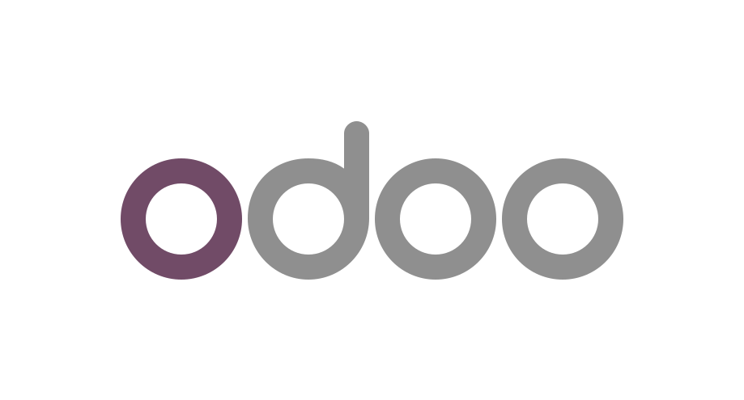

<h1 align="left">👋 Olá! Eu sou Samuel Cardoso</h1>

  <strong>Desenvolvedor</strong>

Desenvolvedor desde 2024, atuo no desenvolvimento de soluções com Python e Odoo, além de ter  experiência prática com frameworks como Streamlit e Odoo (v16+), estruturando módulos, fluxos de trabalho, integrações e automações orientadas a processos internos. Atualmente estou ampliando minhas habilidades, com foco no desenvolvimento full-stack.

Sou movido por **produtividade**, **organização**, **boas práticas** e pelo prazer de resolver problemas com objetividade.

  
  

 

## 📚 Formação Acadêmica

💻 **Bacharel em Engenharia de Software** | ICEV-Instituto de Ensino Superior(2022-2025)
 
🎓 **Bacharel em Administração** | Faculdade Estácio Teresina (2016-2020)
 

---

## 🔧 Linguagens | Frameworks | Ferramentas

  
  
  
  
  
  
  
  
  

---
## 💼 Experiência Profissional

### Greenwave Tecnologia - Desenvolvedor Jr. (2024 - presente)

**Atividades principais e entregas:**
  - 🛠 Construção de módulos e fluxos completos no Odoo
  - 🔗 Integrações entre sistemas: Desenvolvi um módulo de HelpDesk integrado ao Jira via API REST: usuários abrem chamados no Odoo e as issues são criadas automaticamente no Jira,
    centralizando o fluxo de suporte sem necessidade de acesso duplo a sistemas.
  - ⚡ Automação de processos internos
  - 📊 Implementação de soluções para sistema de compras por credenciamento das Secretarias de Saúde de estados do Nordeste

**Tecnologias utilizadas:**  
- Python (v3.10)
- Odoo (v16 / v19)
- JavaScript

---
